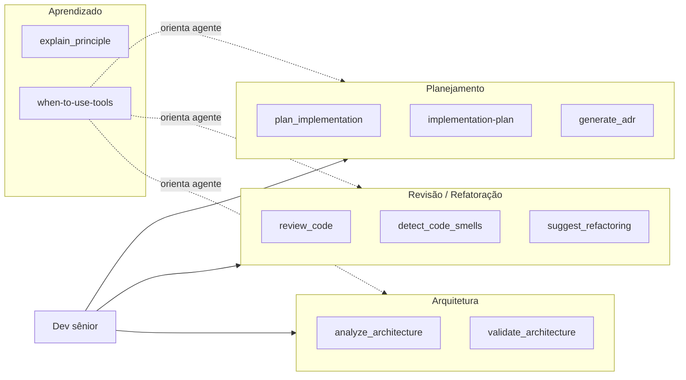

# Plano de Evolução Senior Mind MCP (v4)

Objetivo: tornar o MCP mais **acionável** no fluxo diário do dev sênior (planejamento, revisão, refatoração, TDD, arquitetura) e melhorar a **descoberta** das tools pelo agente de IA.

---

## Alinhamento (questionário adaptado ao MCP)

- **Usuários**: Dev sênior (e equipe) usando IDE (Cursor, Claude Desktop, etc.) com agente de IA; o agente é o consumidor direto das tools/prompts/resources.
- **Regras críticas**: Manter compatibilidade com tools/prompts/resources existentes (evolução aditiva); cada nova capacidade deve ter contrato claro (Zod) e testes.
- **Integrações**: Nenhuma API externa; opcionalmente documentar uso junto com Context7 (já citado no README).
- **Fluxo principal**: Dev pede tarefa ao agente → agente decide quando chamar o Senior Mind (planejamento, revisão, arquitetura, TDD) → usa tools/resources conforme contexto.
- **Erros**: Input inválido (coberto por Zod); tool indisponível não se aplica (stateless).
- **Dados**: Nenhuma persistência; apenas conteúdo estático em resources e lógica nas tools.
- **Segurança**: Sem dados sensíveis; sem requisitos especiais.
- **IDE/Agente**: Cursor (e outros); foco em melhorar a **orientação ao agente** sobre quando usar cada tool.

---

## Diagnóstico rápido (pós-v3)

Com base em [PLANO_EVOLUCAO.md](PLANO_EVOLUCAO.md) e no estado atual:

- **Já entregue em v3**: Modo Mentor, resources expandidos (clean-code-smells, solid-principles, clean-architecture-patterns, design-patterns), `review_code` e `suggest_refactoring` melhorados, `analyze_architecture` contextual, `detect_code_smells`, `validate_architecture`, `explain_principle`, recomendação de agente por fase no `plan_implementation` e no prompt `implementation-plan`.
- **Gaps que ainda agregam valor**:
  - O agente nem sempre sabe **quando** invocar cada tool (falta um "mapa de uso").
  - ADR existe como prompt; pode haver uma **tool** que gera ADR a partir de contexto (decisão + consequências).
  - Não há **checklist de codebase/dívida técnica** reutilizável (sprint de qualidade, onboarding).
  - `tdd-reference` ainda pode ganhar **anti-patterns de teste** (conforme diagnóstico v3).
  - Falta um **fluxo guiado** (ex.: revisão → smells → refatoração) documentado para o agente.

---

## Fases de implementação (evolução do MCP)

As fases são **independentes** (exceto a última, que é documentação/validação). Ordem sugerida abaixo.

### Fase 1: Resource "Quando usar cada tool" (Agente: Rápido)

**Objetivo**: Aumentar a aplicação diária do MCP fazendo o agente saber em que situação chamar cada tool/prompt.

**Arquivos**:

- Novo: [src/resources/when-to-use-tools.ts](../src/resources/when-to-use-tools.ts) — conteúdo em Markdown com:
  - Cenários do dia a dia (ex.: "vou implementar uma feature", "recebi um PR", "preciso refatorar", "preciso decidir arquitetura", "dúvida sobre princípio").
  - Para cada cenário: quais tools/prompts usar e em que ordem (ex.: planejamento → `plan_implementation` ou prompt `implementation-plan`; revisão → `review_code` → `detect_code_smells` → `suggest_refactoring`).
  - Frases-exemplo que o usuário pode dizer para disparar cada tool (útil para regras do Cursor / system prompt).
- Atualizar: [src/resources/index.ts](../src/resources/index.ts) — registrar o novo resource.
- Novo: teste em `tests/resources/` para listagem, URI e termos-chave.

**Entregável**: Resource `when-to-use-tools` (URI sugerida: `senior-mind://references/when-to-use-tools`) disponível e testado.

**Recomendação de agente**: Rápido — conteúdo predominantemente textual e estruturado.

---

### Fase 2: Tool `generate_adr` (Agente: Avançado)

**Objetivo**: Gerar Architecture Decision Record completo a partir de contexto (decisão, alternativas, consequências), complementando o prompt `architecture-decision`.

**Arquivos**:

- Novo: [src/tools/generate-adr.ts](../src/tools/generate-adr.ts) — tool com schema Zod:
  - `title` (string), `context` (string), `decision` (string), `alternatives` (string opcional), `consequences` (string opcional), `technology` (enum opcional).
  - Saída: documento ADR em Markdown (estrutura padrão: Contexto, Decisão, Alternativas consideradas, Consequências) com personalização `{DEVELOPER_NAME}`.
- Atualizar: [src/tools/index.ts](../src/tools/index.ts).
- Novo: [tests/tools/generate-adr.test.ts](../tests/tools/generate-adr.test.ts) — presença de seções, personalização, argumentos opcionais.

**Entregável**: Tool `generate_adr` registrada e coberta por testes.

**Recomendação de agente**: Avançado — definição de contrato e estrutura do documento com regras claras.

---

### Fase 3: Prompt "Checklist codebase / dívida técnica" (Agente: Rápido)

**Objetivo**: Template reutilizável para sprint de qualidade ou onboarding: checklist de dívida técnica, testes, convenções, segurança.

**Arquivos**:

- Novo: [src/prompts/codebase-debt-checklist.ts](../src/prompts/codebase-debt-checklist.ts) — prompt com argumentos:
  - `scope` (string: "sprint", "onboarding", "auditoria"), `technology` (enum: laravel, nestjs, vue, react, generic), `focus` (opcional: testes, segurança, convenções, performance).
  - Template com checklist em tópicos (cobertura de testes, dependências desatualizadas, convenções de código, configuração de segurança, performance, documentação) e sugestão de priorização.
- Atualizar: [src/prompts/index.ts](../src/prompts/index.ts).
- Novo: testes em `tests/prompts/` para argumentos e presença de seções do checklist.

**Entregável**: Prompt `codebase-debt-checklist` disponível e testado.

**Recomendação de agente**: Rápido — template com variáveis e listas.

---

### Fase 4: Expandir `tdd-reference` com anti-patterns de teste (Agente: Avançado)

**Objetivo**: Completar o resource de TDD com anti-patterns (conforme diagnóstico do v3), para o agente e o dev evitarem armadilhas comuns.

**Arquivos**:

- Expandir: [src/resources/tdd-reference.ts](../src/resources/tdd-reference.ts) — nova seção "Anti-patterns de teste":
  - Exemplos: teste que testa implementação em vez de comportamento, teste frágil (acoplado a detalhes), teste que não falha (assert trivial), múltiplos asserts não relacionados, teste lento (sem mocks onde cabível), teste que não é repetível.
  - Cada item: nome, descrição breve, exemplo "evitar" e "preferir" (TypeScript/PHP quando fizer sentido).
- Atualizar testes em `tests/resources/` para validar termos-chave da nova seção.

**Entregável**: Resource `tdd-reference` expandido e testes atualizados.

**Recomendação de agente**: Avançado — conteúdo de domínio e exemplos corretos.

---

### Fase 5: Refinamentos e documentação final (Agente: Misto)

**Objetivo**: Atualizar README, tabelas de componentes e (opcional) regra do Cursor para "quando usar o Senior Mind".

**Tarefas**:

- Atualizar [README.md](../README.md): tabelas de tools, resources e prompts; seção "Uso no dia a dia" ou "Quando usar cada tool" referenciando o novo resource; menção ao prompt `codebase-debt-checklist` e à tool `generate_adr`.
- Opcional: atualizar [.cursor/rules/use-senior-mind-mcp.mdc](../.cursor/rules/use-senior-mind-mcp.mdc) com 1–2 frases que lembrem o agente de consultar o resource `when-to-use-tools` em contextos de planejamento/revisão/arquitetura/TDD.
- Rodar suite completa (`npm run test:run`) e validar no MCP Inspector que todos os componentes aparecem e respondem.

**Recomendação de agente**: Rápido para edição de README e regras; Avançado só se for necessário revisar consistência de toda a documentação.

---

## Resumo das entregas

| Fase | Entrega                                  | Agente sugerido |
| ---- | ---------------------------------------- | --------------- |
| 1    | Resource `when-to-use-tools`             | Rápido          |
| 2    | Tool `generate_adr`                      | Avançado        |
| 3    | Prompt `codebase-debt-checklist`         | Rápido          |
| 4    | Expandir `tdd-reference` (anti-patterns) | Avançado        |
| 5    | README + regra Cursor + testes finais    | Misto           |

**Ordem sugerida**: Fase 1 → 2 → 3 → 4 → 5. Fases 1–4 podem ser feitas em qualquer ordem; a Fase 5 deve ser a última.

---

## Fluxo de valor no dia a dia (após v4)

O resource `when-to-use-tools` passa a orientar o agente sobre **quando** usar cada bloco (planejamento, revisão, arquitetura), aumentando a aplicação do MCP no fluxo diário.

---

## Observações

- Todas as implementações devem seguir o padrão existente: `register(server)` para tools/prompts/resources e testes em `tests/` espelhando `src/`.
- Manter TDD onde houver lógica nova (ex.: tool `generate_adr`): Red → Green → Refactor.
- Nenhuma alteração breaking: schemas aditivos e novos arquivos; não remover ou mudar assinaturas de tools/prompts já expostos.
