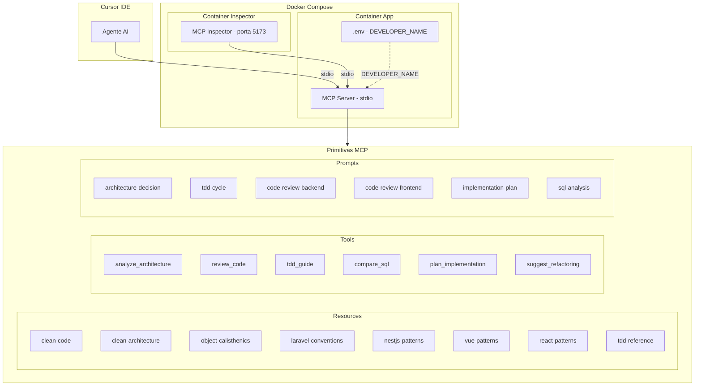

# Plano de Implementacao - Senior Mind MCP (v2)

**Convenção:** Quando uma fase estiver marcada como **(Concluída)** no título ou com status concluído na lista de todos, significa que ela já foi realizada e **não precisa mais ser feita**. Avance para a próxima fase pendente.

**TDD durante o plano:** Em todas as fases que implementam código, seguimos o ciclo **Red → Green → Refactor** (TDD). Ou seja: (1) **Red** — escrever primeiro os testes unitários que falham; (2) **Green** — implementar o mínimo para os testes passarem; (3) **Refactor** — melhorar o código mantendo os testes verdes. Cada fase que entrega código deve incluir ou atualizar testes e só é considerada concluída com os testes passando (`npm test`).

## Boas Praticas MCP Aplicadas ao Projeto

O projeto seguira as boas praticas oficiais do Model Context Protocol:

- **Responsabilidade unica**: O servidor tem um dominio claro - auxiliar desenvolvimento de software com mentalidade senior
- **Toolsets delimitados**: Cada tool tem um contrato especifico com input/output bem definidos via Zod schemas
- **Contratos primeiro**: Schemas rigorosos de entrada/saida, efeitos colaterais explicitos, erros documentados
- **Evolucao aditiva**: Estrutura modular que permite adicionar novas tools/resources/prompts sem alterar as existentes
- **Stateless por padrao**: Nenhum estado mantido entre chamadas; cada invocacao e independente
- **Descricoes especificas e acionaveis**: Cada tool tera descricao clara de proposito, restricoes e orientacao de uso
- **Interfaces estaveis**: Schemas versionados; mudancas sempre aditivas

## Visao Geral da Arquitetura



## Estrutura de Pastas

```
senior-mind-mcp/
  src/
    index.ts                    # Entry point - inicia servidor stdio
    server.ts                   # Configuracao do McpServer
    config.ts                   # Carrega .env (DEVELOPER_NAME, etc)
    tools/
      index.ts                  # Auto-registro de todas as tools
      analyze-architecture.ts
      review-code.ts
      tdd-guide.ts
      compare-sql.ts
      plan-implementation.ts
      suggest-refactoring.ts
    prompts/
      index.ts                  # Auto-registro de todos os prompts
      architecture-decision.ts
      tdd-cycle.ts
      code-review.ts
      implementation-plan.ts
      sql-analysis.ts
    resources/
      index.ts                  # Auto-registro de todos os resources
      clean-code.ts
      clean-architecture.ts
      object-calisthenics.ts
      laravel-conventions.ts
      nestjs-patterns.ts
      vue-patterns.ts
      react-patterns.ts
      tdd-reference.ts
  .env                          # DEVELOPER_NAME=Italo
  .env.example                  # Template do .env
  Dockerfile
  docker-compose.yml
  tests/                       # Testes unitarios (espelham src/)
    config.test.ts
    server.test.ts
    tools/
    ...
  package.json
  tsconfig.json
  vitest.config.ts              # Configuracao Vitest
  README.md
```

---

## Fase 1: Inicializacao do Projeto (Concluída)

**Objetivo**: Criar a base do projeto Node.js/TypeScript com configuracoes minimas.

**O que sera feito**:

- `npm init` com nome `senior-mind-mcp`
- Instalar dependencias: `@modelcontextprotocol/sdk` (v1.x), `zod`, `dotenv`
- Instalar devDependencies: `typescript`, `tsx`, `@types/node`
- Configurar `tsconfig.json` (target ES2022, module NodeNext, strict)
- Criar `.env` com `DEVELOPER_NAME=Italo`
- Criar `.env.example` como template
- Criar `.gitignore` (node_modules, dist, .env)
- Criar `src/config.ts` que carrega e exporta as variaveis de ambiente

Exemplo de `src/config.ts`:

```typescript
import dotenv from "dotenv";
dotenv.config();

export const config = {
  developerName: process.env.DEVELOPER_NAME || "Desenvolvedor",
};
```

**Criterio de conclusao**: `npx tsx src/config.ts` executa sem erros e imprime o nome do desenvolvedor.

**Status**: Concluída.

---

## Fase 2: Ambiente Docker (Concluída)

**Objetivo**: Containerizar o projeto e configurar o MCP Inspector para testes visuais.

**O que sera feito**:

- Criar `Dockerfile` multi-stage (build + runtime com node:22-alpine)
- Criar `docker-compose.yml` com dois servicos:
  - `app`: Container do MCP server (build local, volume para hot-reload com tsx)
  - `inspector`: MCP Inspector (`node` com `npx @modelcontextprotocol/inspector`) expondo porta 5173

Exemplo de `docker-compose.yml`:

```yaml
services:
  app:
    build: .
    volumes:
      - .:/app
      - /app/node_modules
    env_file: .env
    command: npx tsx watch src/index.ts

  inspector:
    image: node:22-alpine
    working_dir: /app
    volumes:
      - .:/app
      - /app/node_modules
    ports:
      - "5173:5173"
    env_file: .env
    command: npx -y @modelcontextprotocol/inspector npx tsx src/index.ts
    depends_on:
      - app
```

- Criar `Dockerfile`:

```dockerfile
FROM node:22-alpine AS builder
WORKDIR /app
COPY package*.json ./
RUN npm ci
COPY . .
RUN npm run build

FROM node:22-alpine
WORKDIR /app
COPY --from=builder /app/dist ./dist
COPY --from=builder /app/node_modules ./node_modules
COPY --from=builder /app/package.json ./
CMD ["node", "dist/index.js"]
```

**Criterio de conclusao**: `docker compose up inspector` sobe o Inspector acessivel em `http://localhost:6274`.

**Status**: Concluída. Portas padrão do Inspector: 6274 (UI) e 6277 (proxy). Foi criado tambem um entry point minimo em `src/index.ts` e `src/server.ts` para o Inspector poder subir o servidor MCP; a Fase 3 expandira esse servidor.

---

## Fase 2b: Ambiente de Testes Unitarios (Vitest) (Concluída)

**Objetivo**: Configurar o Vitest para testes unitarios e garantir que o TDD possa ser seguido nas proximas fases.

**O que sera feito** (TDD: Red → Green → Refactor):

1. **Red**: Criar um teste que valide `config.developerName` (ex.: com mock de `process.env`) — o teste falha ate existir a config.
2. **Green**: Instalar Vitest (`vitest` como devDependency), criar `vitest.config.ts` (com suporte a ESM/TypeScript), configurar script `"test": "vitest"` e `"test:run": "vitest run"` no `package.json`. Ajustar o teste para passar usando `src/config.ts`.
3. **Refactor**: Organizar pasta `tests/` (ex.: `tests/config.test.ts`). Garantir que `npm test` e `npm run test:run` executam sem erros.

Estrutura sugerida:

- `vitest.config.ts`: configuração com `globals` opcional, `include: ["tests/**/*.test.ts"]`, ambiente `node`.
- `tests/config.test.ts`: testes para `config.developerName` (valor default quando `DEVELOPER_NAME` ausente; valor do env quando definido).

**Criterio de conclusao**: `npm run test:run` executa os testes de config e todos passam. Nenhuma fase seguinte que implementar codigo deve ser dada como concluida sem testes passando.

**Status**: Concluída. Vitest instalado (v2.x), `vitest.config.ts` criado, scripts `test` e `test:run` adicionados ao `package.json`. Teste `tests/config.test.ts` valida o valor default e o valor do env com mock de dotenv.

---

## Fase 3: Servidor MCP Base (Concluída)

**Objetivo**: Criar o servidor MCP funcional com stdio e uma tool de teste.

**TDD**: (1) **Red** — escrever testes em `tests/server.test.ts` que validem que o servidor expoe a tool `ping` e que a resposta contem o texto esperado (usando nome do config); (2) **Green** — implementar `src/server.ts` e `src/index.ts` para os testes passarem; (3) **Refactor** — se necessario.

**O que sera feito**:

- Criar `src/server.ts` com instancia do `McpServer`
- Criar `src/index.ts` com `StdioServerTransport` e conexao
- Registrar tool `ping` que retorna "pong - Senior Mind MCP ativo! Ola, {DEVELOPER_NAME}!"
- Configurar scripts no `package.json`: `build`, `start`, `dev`
- Escrever testes unitarios que validem a tool `ping` e o conteudo da resposta

Exemplo de `src/server.ts`:

```typescript
import { McpServer } from "@modelcontextprotocol/sdk/server/mcp.js";
import { config } from "./config.js";

export function createServer(): McpServer {
  const server = new McpServer({
    name: "senior-mind",
    version: "1.0.0",
  });

  server.tool(
    "ping",
    "Testa a conexao com o Senior Mind MCP",
    {},
    async () => ({
      content: [{
        type: "text",
        text: `pong - Senior Mind MCP ativo! Ola, ${config.developerName}!`,
      }],
    })
  );

  return server;
}
```

**Criterio de conclusao**: Testes em `tests/server.test.ts` passam (`npm run test:run`). Testar via MCP Inspector - tool `ping` responde com o nome do `.env`.

**Status**: Concluída. `src/server.ts` e `src/index.ts` ja existiam da Fase 2. Testes em `tests/server.test.ts` validam: listagem da tool `ping`, resposta com texto esperado e inclusao do nome do desenvolvedor. Usa `InMemoryTransport` para testar o servidor sem stdio. Todos os 5 testes passam.

---

## Fase 4: Sistema de Registro Automatico (Concluída)

**Objetivo**: Criar a infraestrutura que permite adicionar novas tools/prompts/resources de forma modular, sem alterar arquivos centrais.

**TDD**: (1) **Red** — testes que verifiquem que, apos registrar tools/prompts/resources via `registerAll*`, o servidor expoe as capacidades esperadas (ex.: listagem de tools inclui `ping` e as novas); (2) **Green** — implementar os `index.ts` de registro e migrar `ping` para o padrao; (3) **Refactor** — se necessario.

**O que sera feito**:

- Criar `src/tools/index.ts` - funcao `registerAllTools(server)` que importa e registra todas as tools
- Criar `src/prompts/index.ts` - funcao `registerAllPrompts(server)` que importa e registra todos os prompts
- Criar `src/resources/index.ts` - funcao `registerAllResources(server)` que importa e registra todos os resources
- Cada modulo (tool/prompt/resource) exporta uma funcao padrao `register(server: McpServer)`
- Atualizar `src/server.ts` para chamar os tres registradores

Padrao de cada modulo:

```typescript
// src/tools/analyze-architecture.ts
import { McpServer } from "@modelcontextprotocol/sdk/server/mcp.js";
import { z } from "zod";

export function register(server: McpServer): void {
  server.tool(
    "analyze_architecture",
    "Analisa um problema e propoe opcoes de arquitetura fundamentadas",
    { /* schema zod */ },
    async (params) => { /* implementacao */ }
  );
}
```

```typescript
// src/tools/index.ts
import { McpServer } from "@modelcontextprotocol/sdk/server/mcp.js";
import { register as analyzeArchitecture } from "./analyze-architecture.js";
// ... demais imports

export function registerAllTools(server: McpServer): void {
  analyzeArchitecture(server);
  // ... demais registros
}
```

**Por que esse padrao**: Para adicionar uma nova tool, basta criar o arquivo, exportar `register`, e adicionar uma linha no `index.ts` da pasta. Nenhum outro arquivo precisa ser alterado. Isso sera documentado no README.

**Criterio de conclusao**: Testes passam para o novo sistema de registro. Tool `ping` migrada para o novo padrao e funcionando no Inspector.

**Status**: Concluída. Tool `ping` migrada para `src/tools/ping.ts` com padrao `register(server)`. Criados `src/tools/index.ts` (`registerAllTools`), `src/prompts/index.ts` (`registerAllPrompts`) e `src/resources/index.ts` (`registerAllResources`). `src/server.ts` atualizado para chamar os tres registradores. Testes em `tests/tools/ping.test.ts` (modulo isolado) e `tests/server.test.ts` (registro automatico) — 10 testes passando.

---

## Fase 5: Resources - Fundamentos (Clean Code, Clean Architecture, Object Calisthenics) (Concluída)

**Objetivo**: Criar os 3 resources fundamentais que embasam todas as decisoes do senior developer.

**TDD**: (1) **Red** — testes que verifiquem que os resources `clean-code`, `clean-architecture` e `object-calisthenics` estao disponiveis e retornam conteudo nao vazio (e contem termos-chave esperados); (2) **Green** — implementar os tres resources; (3) **Refactor** — se necessario.

**Resources**:

1. **`clean-code`** (URI: `senior-mind://references/clean-code`)
   - Principios de Robert C. Martin: nomes significativos, funcoes pequenas, DRY, KISS, SRP, OCP
   - Exemplos de boas e mas praticas
   - Regras de formatacao e comentarios

2. **`clean-architecture`** (URI: `senior-mind://references/clean-architecture`)
   - 4 camadas: Entities, Use Cases, Interface Adapters, Frameworks & Drivers
   - Regra de Dependencia (sempre de fora para dentro)
   - Boundary crossing e inversao de dependencia
   - Quando usar cada camada com exemplos

3. **`object-calisthenics`** (URI: `senior-mind://references/object-calisthenics`)
   - As 9 regras de Jeff Bay com explicacao e exemplos:
     1. Um nivel de indentacao por metodo
     2. Nao use ELSE
     3. Encapsule tipos primitivos
     4. Colecoes de primeira classe
     5. Um ponto por linha
     6. Nao abrevie
     7. Mantenha entidades pequenas
     8. Nao mais que 2 variaveis de instancia
     9. Sem getters/setters

**Criterio de conclusao**: Testes unitarios para os 3 resources passam. Os 3 resources aparecem na aba Resources do Inspector com conteudo completo.

**Status**: Concluída. Criados `src/resources/clean-code.ts`, `src/resources/clean-architecture.ts` e `src/resources/object-calisthenics.ts` com conteudo completo em Markdown. Registrados em `src/resources/index.ts`. Testes em `tests/resources/fundamentals.test.ts` (11 testes) validam listagem, URIs, conteudo nao vazio e termos-chave. Total: 21 testes passando.

---

## Fase 6: Resources - Backend (Laravel, NestJS, TDD) (Concluída)

**Objetivo**: Criar os resources de referencia para tecnologias backend.

**TDD**: (1) **Red** — testes para os resources `laravel-conventions`, `nestjs-patterns` e `tdd-reference` (disponibilidade e conteudo nao vazio); (2) **Green** — implementar os tres resources; (3) **Refactor** — se necessario.

**Resources**:

1. **`laravel-conventions`** (URI: `senior-mind://references/laravel-conventions`)
   - Nomenclatura: Model (singular), Controller (plural), Migration, FormRequest, Resource, Policy
   - Estrutura de pastas padrao
   - Padroes Eloquent (scopes, relationships, accessors/mutators)
   - Service Pattern e Repository Pattern no contexto Laravel

2. **`nestjs-patterns`** (URI: `senior-mind://references/nestjs-patterns`)
   - Modules, Controllers, Providers/Services
   - DTOs com class-validator, Pipes, Guards, Interceptors
   - Injecao de dependencia e modularidade
   - Repository Pattern com TypeORM/Prisma

3. **`tdd-reference`** (URI: `senior-mind://references/tdd-reference`)
   - Ciclo Red-Green-Refactor de Kent Beck
   - Estrategias: Fake It, Triangulation, Obvious Implementation
   - Tipos de teste: unitario, integracao, e2e
   - Boas praticas: AAA (Arrange-Act-Assert), test doubles

**Criterio de conclusao**: Testes unitarios para os 3 resources passam. Os 3 resources aparecem no Inspector com conteudo completo.

**Status**: Concluída. Criados `src/resources/laravel-conventions.ts`, `src/resources/nestjs-patterns.ts` e `src/resources/tdd-reference.ts`. Registrados em `src/resources/index.ts`. Testes em `tests/resources/backend.test.ts` (10 testes) validam listagem, URIs, conteudo e termos-chave. Total: 31 testes passando.

---

## Fase 7: Resources - Frontend (Vue 3, React 18) (Concluída)

**Objetivo**: Criar os resources de referencia para tecnologias frontend.

**TDD**: (1) **Red** — testes para `vue-patterns` e `react-patterns` (disponibilidade e conteudo nao vazio); (2) **Green** — implementar os dois resources; (3) **Refactor** — se necessario.

**Resources**:

1. **`vue-patterns`** (URI: `senior-mind://references/vue-patterns`)
   - Composition API: ref, reactive, computed, watch, watchEffect
   - Script setup e organizacao de componentes
   - Composables pattern (extrair logica reutilizavel)
   - Props tipadas, emits, provide/inject

2. **`react-patterns`** (URI: `senior-mind://references/react-patterns`)
   - Hooks: useState, useEffect, useCallback, useMemo, useRef
   - Custom hooks e regras de hooks
   - Padroes: Container/Presentational, Compound Components, Render Props
   - React.memo, useMemo, useCallback para performance

**Criterio de conclusao**: Testes unitarios para os 2 resources passam. Os 2 resources aparecem no Inspector com conteudo completo.

**Status**: Concluída. Criados `src/resources/vue-patterns.ts` e `src/resources/react-patterns.ts`. Registrados em `src/resources/index.ts`. Testes em `tests/resources/frontend.test.ts` (7 testes) validam listagem, URIs, conteudo e termos-chave. Total: 38 testes passando.

---

## Fase 8: Tool - analyze_architecture (Concluída)

**Objetivo**: Criar a tool que analisa problemas e propoe opcoes de arquitetura fundamentadas.

**TDD**: (1) **Red** — testes que chamem `analyze_architecture` com um problema e tecnologia e validem que a resposta contem opcoes, pros/contras e recomendacao; (2) **Green** — implementar a tool; (3) **Refactor** — se necessario.

**Especificacao**:

- **Nome**: `analyze_architecture`
- **Descricao**: "Analisa um problema/feature e propoe opcoes de arquitetura fundamentadas em Clean Architecture e boas praticas"
- **Input Schema (Zod)**:
  - `problem` (string, obrigatorio): Descricao do problema ou feature
  - `technology` (enum: "laravel", "nestjs", "generic", obrigatorio): Stack tecnologica
  - `context` (string, opcional): Contexto adicional (restricoes, requisitos nao-funcionais)
- **Output**: 2-3 opcoes de arquitetura com pros/contras, citacao dos principios (Clean Architecture, SOLID), e recomendacao final personalizada para `{DEVELOPER_NAME}`

**Criterio de conclusao**: Testes unitarios para `analyze_architecture` passam. Tool testada no Inspector com diferentes cenarios.

**Status**: Concluída. Criado `src/tools/analyze-architecture.ts` com schema Zod (problem, technology, context), 3 opcoes de arquitetura (Clean Architecture, Service Layer, DDD), recomendacao inteligente baseada no contexto e personalizacao com DEVELOPER_NAME. Testes em `tests/tools/analyze-architecture.test.ts` (10 testes). Total: 48 testes passando.

---

## Fase 9: Tool - review_code

**Objetivo**: Criar a tool de revisao de codigo contra principios Clean Code e Object Calisthenics.

**TDD**: (1) **Red** — testes com trechos de codigo que violem principios conhecidos; validar que a resposta lista violacoes e sugestoes; (2) **Green** — implementar a tool; (3) **Refactor** — se necessario.

**Especificacao**:

- **Nome**: `review_code`
- **Descricao**: "Revisa codigo contra principios de Clean Code e Object Calisthenics, identificando violacoes"
- **Input Schema (Zod)**:
  - `code` (string, obrigatorio): Codigo a ser revisado
  - `language` (enum: "php", "typescript", "javascript", "vue", "react", obrigatorio)
  - `focus` (enum: "clean-code", "object-calisthenics", "all", default "all")
- **Output**: Lista de violacoes com: principio violado, localizacao, severidade (alta/media/baixa), sugestao de correcao. Enderecado a `{DEVELOPER_NAME}`.

**Criterio de conclusao**: Testes unitarios para `review_code` passam. Tool identifica corretamente violacoes em codigo de exemplo.

---

## Fase 10: Tool - suggest_refactoring

**Objetivo**: Criar a tool que sugere refatoracoes baseadas em Object Calisthenics com interacao.

**TDD**: (1) **Red** — testes com codigo que viole regras de Object Calisthenics; validar que a resposta contem regra violada, antes/depois e pergunta para o desenvolvedor; (2) **Green** — implementar a tool; (3) **Refactor** — se necessario.

**Especificacao**:

- **Nome**: `suggest_refactoring`
- **Descricao**: "Sugere refatoracoes baseadas nas 9 regras de Object Calisthenics com antes/depois"
- **Input Schema (Zod)**:
  - `code` (string, obrigatorio): Codigo a ser refatorado
  - `language` (enum: "php", "typescript", "javascript", obrigatorio)
  - `rules` (array de strings, opcional): Regras especificas a verificar (default: todas)
- **Output**: Para cada violacao, retorna: regra violada, codigo original, codigo refatorado, e a pergunta interativa: "{DEVELOPER_NAME}, deseja aplicar a regra [X] do Object Calisthenics aqui?"

**Criterio de conclusao**: Testes unitarios para `suggest_refactoring` passam. Tool gera sugestoes de refatoracao com antes/depois.

---

## Fase 11: Tool - tdd_guide

**Objetivo**: Implementar o fluxo TDD obrigatorio com gates de aprovacao.

**TDD**: (1) **Red** — testes para cada fase (red, green, refactor): validar que a saida contem o esperado (ex.: red gera cenarios de teste e mensagem para o desenvolvedor); (2) **Green** — implementar a tool; (3) **Refactor** — se necessario.

**Especificacao**:

- **Nome**: `tdd_guide`
- **Descricao**: "Guia o ciclo TDD (Red-Green-Refactor) com gates de aprovacao entre fases"
- **Input Schema (Zod)**:
  - `feature` (string, obrigatorio): Descricao da feature
  - `phase` (enum: "red", "green", "refactor", obrigatorio): Fase atual do TDD
  - `technology` (enum: "laravel", "nestjs", obrigatorio)
  - `code` (string, opcional): Codigo atual da implementacao (para green/refactor)
  - `test_code` (string, opcional): Codigo do teste (para green/refactor)
- **Comportamento por fase**:
  - **Red**: Gera esqueleto de teste com cenarios (happy path, edge cases, error cases). Finaliza: "{DEVELOPER_NAME}, analise os cenarios do teste antes de prosseguir para a fase Green."
  - **Green**: Sugere implementacao minima para passar os testes. Foco em "make it work".
  - **Refactor**: Analisa contra Object Calisthenics e Clean Code. Sugere melhorias especificas.

**Criterio de conclusao**: Testes unitarios para `tdd_guide` passam. Tool guia corretamente pelas 3 fases no Inspector.

---

## Fase 12: Tool - compare_sql

**Objetivo**: Criar a tool de comparacao entre abordagens ORM e SQL puro.

**TDD**: (1) **Red** — testes com descricao de query e tecnologia; validar que a resposta inclui versao ORM, SQL puro e comparacao/recomendacao; (2) **Green** — implementar a tool; (3) **Refactor** — se necessario.

**Especificacao**:

- **Nome**: `compare_sql`
- **Descricao**: "Compara abordagem ORM vs SQL puro para queries complexas, com analise de performance"
- **Input Schema (Zod)**:
  - `description` (string, obrigatorio): Descricao da query desejada
  - `technology` (enum: "laravel-eloquent", "typeorm", "prisma", obrigatorio)
  - `tables` (string, opcional): Estrutura das tabelas envolvidas
  - `context` (string, opcional): Contexto adicional (volume de dados, indices, etc)
- **Output**: Versao ORM, versao SQL puro, comparacao de performance (N+1, JOINs, indices), recomendacao com justificativa. Contexto PostgreSQL/Saude quando aplicavel.

**Criterio de conclusao**: Testes unitarios para `compare_sql` passam. Tool gera comparacoes uteis para queries complexas.

---

## Fase 13: Tool - plan_implementation

**Objetivo**: Criar a tool de planejamento com questionario de alinhamento.

**TDD**: (1) **Red** — testes com feature e tecnologia; validar que a resposta contem perguntas de alinhamento e plano em fases; (2) **Green** — implementar a tool; (3) **Refactor** — se necessario.

**Especificacao**:

- **Nome**: `plan_implementation`
- **Descricao**: "Cria plano de implementacao faseado, fazendo perguntas para alinhar regras de negocio"
- **Input Schema (Zod)**:
  - `feature` (string, obrigatorio): Descricao da feature
  - `technology` (enum: "laravel", "nestjs", obrigatorio)
  - `requirements` (string, opcional): Requisitos ja conhecidos
- **Output**: Primeiro, gera perguntas de alinhamento sobre regra de negocio. Depois, gera plano dividido em fases independentes (cada fase cabe no contexto do agente), com: estrutura de arquivos, padroes, testes necessarios, e ordem de execucao.

**Criterio de conclusao**: Testes unitarios para `plan_implementation` passam. Tool gera perguntas relevantes e plano faseado.

---

## Fase 14: Prompts - Arquitetura e TDD

**Objetivo**: Criar os prompts reutilizaveis para decisoes de arquitetura e fluxo TDD.

**TDD**: (1) **Red** — testes que obtenham os prompts `architecture-decision` e `tdd-cycle` com argumentos e validem que as mensagens geradas contem os argumentos e secoes esperadas; (2) **Green** — implementar os dois prompts; (3) **Refactor** — se necessario.

**Prompts**:

1. **`architecture-decision`**
   - **Args**: `problem` (string), `constraints` (string, opcional)
   - Template ADR (Architecture Decision Record) formal com secoes: Contexto, Decisao, Consequencias, Alternativas Consideradas
   - Usa `{DEVELOPER_NAME}` no template

2. **`tdd-cycle`**
   - **Args**: `feature` (string), `technology` (string)
   - Template completo do ciclo TDD com instrucoes passo a passo para Red, Green e Refactor
   - Inclui checklist de cada fase

**Criterio de conclusao**: Testes unitarios para os prompts passam. Prompts aparecem na aba Prompts do Inspector e geram templates uteis.

---

## Fase 15: Prompts - Code Review

**Objetivo**: Criar os prompts de code review para backend e frontend.

**TDD**: (1) **Red** — testes para `code-review-backend` e `code-review-frontend` com argumentos; validar que as mensagens contem o codigo e o framework; (2) **Green** — implementar os prompts; (3) **Refactor** — se necessario.

**Prompts**:

1. **`code-review-backend`**
   - **Args**: `code` (string), `framework` (enum: "laravel", "nestjs")
   - Template de review focado em: Clean Code, convencoes do framework, SOLID, performance SQL

2. **`code-review-frontend`**
   - **Args**: `code` (string), `framework` (enum: "vue", "react")
   - Template de review focado em: Composition API/hooks, reatividade, componentizacao, performance

**Criterio de conclusao**: Testes unitarios para os prompts passam. Prompts geram templates de review especificos por stack.

---

## Fase 16: Prompts - Planejamento e SQL

**Objetivo**: Criar os prompts de planejamento e analise SQL.

**TDD**: (1) **Red** — testes para `implementation-plan` e `sql-analysis` com argumentos; validar que as mensagens contem feature/query e orientacoes esperadas; (2) **Green** — implementar os prompts; (3) **Refactor** — se necessario.

**Prompts**:

1. **`implementation-plan`**
   - **Args**: `feature` (string), `context` (string, opcional)
   - Template que gera questionario de alinhamento + plano faseado com checklist

2. **`sql-analysis`**
   - **Args**: `query` (string), `context` (string, opcional)
   - Template para analise profunda: EXPLAIN ANALYZE, indices sugeridos, N+1, JOINs vs subqueries

**Criterio de conclusao**: Testes unitarios para os prompts passam. Prompts geram templates uteis e acionaveis.

---

## Fase 17: README, Documentacao e Configuracao Final

**Objetivo**: Documentar tudo e garantir que o projeto e facil de evoluir.

**TDD**: Nesta fase nao ha codigo de producao novo; manter a suite de testes passando e documentar no README como executar os testes (`npm test`, `npm run test:run`).

**O que sera feito**:

1. **README.md completo** com:
   - Descricao do projeto e proposito
   - Requisitos (Docker, Node.js)
   - Como executar (`docker compose up`)
   - Como rodar os testes unitarios (`npm test`, `npm run test:run`)
   - Como testar com o MCP Inspector
   - Lista de todas as tools, prompts e resources disponiveis
   - Configuracao do `.env`

2. **Guia de Extensibilidade** (secao no README):
   - "Como adicionar uma nova Tool" - passo a passo com template
   - "Como adicionar um novo Resource" - passo a passo com template
   - "Como adicionar um novo Prompt" - passo a passo com template
   - Convencoes de nomenclatura e organizacao
   - Exemplo completo de cada tipo

3. **Integracao Context7**: Secao explicando como usar o Context7 MCP em conjunto para:
   - Memoria de longo prazo das decisoes tomadas
   - Busca de documentacao de frameworks

4. **Configuracao Cursor**: Instruir como adicionar ao `.cursor/mcp.json`:

```json
{
  "mcpServers": {
    "senior-mind": {
      "command": "docker",
      "args": ["compose", "exec", "app", "node", "dist/index.js"]
    }
  }
}
```

Ou para uso direto (sem Docker):

```json
{
  "mcpServers": {
    "senior-mind": {
      "command": "npx",
      "args": ["tsx", "src/index.ts"],
      "cwd": "/caminho/para/senior-mind-mcp",
      "env": { "DEVELOPER_NAME": "Italo" }
    }
  }
}
```

5. **Nota sobre observabilidade**: Registrar no README que logs e configs de K8s NAO sao incluidos por padrao (apenas sob solicitacao explicita)

**Criterio de conclusao**: README completo, projeto configurado no Cursor e funcionando end-to-end.

---

## Dependencias do Projeto

```json
{
  "dependencies": {
    "@modelcontextprotocol/sdk": "^1.26.0",
    "zod": "^3.25.0",
    "dotenv": "^16.4.0"
  },
  "devDependencies": {
    "@types/node": "^22.0.0",
    "tsx": "^4.0.0",
    "typescript": "^5.7.0",
    "vitest": "^2.0.0"
  }
}
```

## Resumo das Boas Praticas MCP no Projeto

- **Schemas Zod rigorosos** em todas as tools (validacao de entrada na primeira falha)
- **Descricoes claras e acionaveis** em cada tool/prompt/resource
- **Modularidade**: Padrao `register(server)` para extensibilidade sem tocar no core
- **Personalizacao via .env**: Nome do desenvolvedor configuravel, sem hardcode
- **Docker para isolamento**: Ambiente reproduzivel e MCP Inspector integrado
- **Sem estado**: Cada chamada e independente; sem memoria entre invocacoes
- **Sem kitchen-sink**: Cada tool faz UMA coisa bem feita
- **Evolucao aditiva**: Adicionar features novas nunca quebra as existentes
