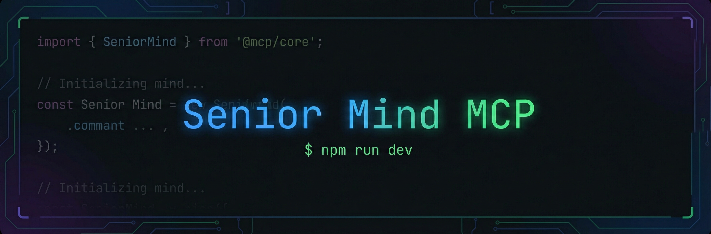

<p align="center">
  
</p>

# Senior Mind MCP

MCP (Model Context Protocol) server que replica a mentalidade de um desenvolvedor senior. Fornece tools, resources e prompts para guiar agentes de IA (Cursor, Claude Desktop, etc.) com boas praticas de engenharia de software.

## O que e?

O Senior Mind MCP atua como um **copiloto senior** para o seu agente de IA. Em vez de depender apenas do conhecimento geral do LLM, o agente passa a ter acesso a:

- **Principios de Clean Code e Object Calisthenics** para revisoes fundamentadas
- **Convencoes de frameworks** (Laravel, NestJS, Vue 3, React 18) para codigo idiomatico
- **Ferramentas de analise** de arquitetura, code review, refatoracao e TDD
- **Templates estruturados** para decisoes de arquitetura, planejamento e analise SQL

---

## Requisitos

- [Docker](https://docs.docker.com/get-docker/) e Docker Compose
- Ou: [Node.js](https://nodejs.org/) >= 22 (para uso sem Docker)

---

## Inicio Rapido

### 1. Clone o repositorio

```bash
git clone <url-do-repositorio>
cd senior-mind-mcp
```

### 2. Configure o ambiente

```bash
cp .env.example .env
```

Edite o `.env` com seu nome:

```env
DEVELOPER_NAME=SeuNome
```

A variavel `DEVELOPER_NAME` personaliza as mensagens e templates gerados pelo MCP. Se nao definida, assume "Desenvolvedor".

### 3. Execute com Docker

```bash
docker compose up -d
```

Isso inicia dois servicos:

| Servico | Descricao |
|---------|-----------|
| `app` | Servidor MCP (stdio) com hot reload |
| `inspector` | MCP Inspector UI em `http://localhost:6274` |

### 4. Teste com o MCP Inspector

Acesse `http://localhost:6274` no navegador. La voce pode:

- **Tools**: Selecionar e executar qualquer tool com argumentos
- **Resources**: Consultar os resources de conhecimento
- **Prompts**: Invocar prompts e preencher os argumentos para gerar templates

---

## Testes

O projeto segue TDD (Test-Driven Development) com mais de 220 testes cobrindo todas as tools, resources e prompts.

```bash
# Modo watch (re-executa ao salvar)
docker compose exec app npm test

# Execucao unica
docker compose exec app npm run test:run
```

Sem Docker:

```bash
npm test
npm run test:run
```

---

## Componentes Disponiveis

### Tools (11)

Tools sao **acoes que o agente executa** automaticamente quando detecta que precisa analisar, revisar ou gerar algo.

| Tool | Descricao | Argumentos |
|------|-----------|------------|
| `ping` | Verifica se o MCP esta ativo | — |
| `analyze_architecture` | Analisa um problema e propoe opcoes de arquitetura (Clean Architecture, Service Layer, DDD) com pros/cons e recomendacao | `problem`, `technology`, `context` |
| `review_code` | Revisa codigo contra Clean Code e Object Calisthenics, identificando violacoes com severidade e sugestoes | `code`, `language`, `focus` |
| `suggest_refactoring` | Sugere refatoracoes baseadas nas 9 regras de Object Calisthenics com exemplos antes/depois | `code`, `language`, `rules` |
| `tdd_guide` | Guia o ciclo TDD (Red-Green-Refactor) com gates de aprovacao entre fases | `feature`, `phase`, `technology`, `code`, `test_code` |
| `compare_sql` | Compara abordagem ORM vs SQL puro com analise de performance | `description`, `technology`, `tables`, `context` |
| `plan_implementation` | Gera plano de implementacao faseado com perguntas de alinhamento e **recomendacao de agente de IA por fase** | `feature`, `technology`, `requirements`, `team_context` (opcional) |
| `detect_code_smells` | Detecta code smells por categoria (comments, functions, general, names, all): magic numbers, flag arguments, feature envy, God class, Long Method, Data Clumps, etc. | `code`, `language`, `category` |
| `validate_architecture` | Valida conformidade com camadas do Clean Architecture; reporta imports invalidos e sugestoes | `structure`, `technology`, `layer` |
| `explain_principle` | Dicionario de principios (SRP, OCP, LSP, ISP, DIP, DRY, KISS, YAGNI, Demeter, Tell Don't Ask, FIRST, SOLID): explicacao, exemplo, contra-exemplo | `principle`, `language`, `context` (opcional) |

### Resources (12)

Resources sao a **base de conhecimento passiva** que o agente consulta automaticamente para fundamentar suas respostas.

| Resource | URI | Conteudo |
|----------|-----|----------|
| Clean Code | `senior-mind://references/clean-code` | Principios, nomenclatura, funcoes, tratamento de erros, boundaries, CQS, emergence |
| Clean Code Smells | `senior-mind://references/clean-code-smells` | Code smells em 6 categorias (Comentarios, Funcoes, Gerais, Nomes, Testes) com exemplo e correcao |
| SOLID Principles | `senior-mind://references/solid-principles` | SRP, OCP, LSP, ISP, DIP com violacao e correcao em TypeScript e PHP |
| Clean Architecture | `senior-mind://references/clean-architecture` | Camadas, regra de dependencia, use cases, adapters, Screaming Architecture, Humble Object |
| Clean Architecture Patterns | `senior-mind://references/clean-architecture-patterns` | Repository, Gateway, Presenter, DTOs, Use Case Interactor, Mapper, Domain Events |
| Design Patterns | `senior-mind://references/design-patterns` | GoF no contexto Clean Architecture: Factory, Builder, Adapter, Strategy, Observer, Command |
| Object Calisthenics | `senior-mind://references/object-calisthenics` | 9 regras com exemplos de violacao e correcao |
| Laravel Conventions | `senior-mind://references/laravel-conventions` | Eloquent, FormRequest, Resources, Service Pattern, N+1 |
| NestJS Patterns | `senior-mind://references/nestjs-patterns` | Modules, DI, DTOs, Pipes, Guards, Interceptors, Repository |
| TDD Reference | `senior-mind://references/tdd-reference` | Red-Green-Refactor, estrategias, metricas, patterns de teste |
| Vue 3 Patterns | `senior-mind://references/vue-patterns` | Composition API, script setup, composables, reatividade, performance |
| React 18 Patterns | `senior-mind://references/react-patterns` | Hooks, custom hooks, component patterns, memoizacao, Suspense |

### Prompts (7)

Prompts sao **templates estruturados** que o usuario invoca explicitamente para iniciar uma conversa guiada.

| Prompt | Descricao | Argumentos |
|--------|-----------|------------|
| `architecture-decision` | Gera template ADR (Architecture Decision Record) | `problem` (obrigatorio), `constraints` (opcional) |
| `tdd-cycle` | Gera guia completo Red-Green-Refactor com checklists | `feature`, `technology` |
| `code-review-backend` | Template de code review para backend | `code`, `framework` (laravel/nestjs) |
| `code-review-frontend` | Template de code review para frontend | `code`, `framework` (vue/react) |
| `implementation-plan` | Questionario de alinhamento + plano faseado com **recomendacao de agente de IA por fase** | `feature`, `context` (opcional), `team_context` (opcional) |
| `sql-analysis` | Analise profunda de query SQL | `query`, `context` (opcional) |
| `mentor-mode` | Instrui o agente a NAO escrever codigo final ate completar checkpoints de Clean Architecture, Clean Code e TDD | `feature`, `technology`, `complexity` (opcional) |

---

## Modo Mentor

O prompt **`mentor-mode`** guia o agente a **nao escrever codigo final** ate que checkpoints de qualidade sejam completados. Ideal para features que exigem decisões de arquitetura e design antes da implementacao.

**Checkpoints:**

1. **Analise Arquitetural** — Camadas (Entity, Use Case, Adapter, Framework), regra de dependencia, DIP  
2. **Revisao Clean Code** — Convencoes de nomes, tamanho de funcoes, tratamento de erros, DRY/KISS/YAGNI  
3. **Contratos e Interfaces (SOLID)** — Ports, DTOs, SRP/OCP  
4. **Estrategia de Testes (TDD)** — Cenarios por Use Case, test doubles, ordem Entity → Use Case → Adapter  
5. **Implementacao Guiada** — So apos aprovacao dos anteriores; TDD rigoroso e Object Calisthenics no refactor  

**Complexidade:** `low` (checkpoints simplificados), `medium` (completos), `high` (+ trade-offs e ADR).

**Uso:** Invoque o prompt `mentor-mode` com a feature e a stack (laravel/nestjs/generic). O agente recebera um template com os 5 checkpoints e so deve prosseguir para codigo apos cada gate.

---

## Recomendacao de Agente de IA

A tool **`plan_implementation`** e o prompt **`implementation-plan`** incluem **recomendacao de qual modelo de IA usar em cada fase** do plano (rapido vs avancado), para otimizar custo sem perder qualidade.

**Logica por fase:**

| Fase | Agente recomendado | Motivo |
|------|--------------------|--------|
| 1. Entidades/Modelagem | Avancado | Decisoes de dominio, atributos, relacionamentos |
| 2. Repository | Rapido | Boilerplate previsivel |
| 3. Service/TDD | Avancado | Logica de negocio, cenarios de teste, design |
| 4. API/Controller | Rapido | Controller fino, DTOs, rotas — padrao mecanico |
| 5. Refinamentos | Misto | Paginacao/filtros (rapido); cache/performance (avancado) |

Cada fase no plano exibe **Nivel do modelo**, **Justificativa** e **Dica de uso** (como instruir o agente). Ao final do plano, uma **tabela resumo** consolida a recomendacao por fase.

**Parametro `team_context` (opcional):** Informe o nivel da equipe (ex.: "equipe junior, 2 devs"). Para equipes menos experientes, o MCP pode recomendar modelo avancado em mais fases (incluindo Repository e API) para reduzir retrabalho.

**Pergunta de alinhamento:** O questionario inclui "Qual IDE/agente de IA voce esta usando? (Cursor, Claude Desktop, Copilot, outro)" para adaptar as dicas (ex.: no Cursor, usar Agent mode para tarefas avancadas).

---

## Como o Agente de IA Usa o Senior Mind

### Resources — Base de conhecimento passiva

Resources sao **lidos automaticamente** pelo agente quando ele precisa de contexto sobre um assunto. O agente consulta resources como se fosse uma documentacao interna.

**Exemplos de uso real:**

- Ao pedir "revise este codigo", o agente le `senior-mind://clean-code` e `senior-mind://object-calisthenics` para fundamentar a revisao
- Ao trabalhar com Laravel, o agente le `senior-mind://laravel-conventions` para aplicar convencoes corretas
- Ao discutir arquitetura, o agente le `senior-mind://clean-architecture` como referencia

### Tools — Acoes que o agente executa

Tools sao **chamadas ativamente** pelo agente quando detecta que precisa executar uma analise ou gerar algo. O agente decide sozinho qual tool usar com base no pedido do usuario.

**Exemplos de uso real:**

- Usuario: "Analise a arquitetura para um modulo de pagamentos" → agente chama `analyze_architecture`
- Usuario: "Revise este codigo" → agente chama `review_code` com o codigo
- Usuario: "Detecte code smells neste trecho" → agente chama `detect_code_smells` (por categoria)
- Usuario: "Valide se esta estrutura respeita Clean Architecture" → agente chama `validate_architecture`
- Usuario: "Explique o principio SRP em TypeScript" → agente chama `explain_principle`
- Usuario: "Sugira refatoracoes para esta classe" → agente chama `suggest_refactoring`
- Usuario: "Me guie no TDD para criar um endpoint de usuarios" → agente chama `tdd_guide` com `phase="red"`
- Usuario: "Compare ORM vs SQL para esta query" → agente chama `compare_sql`
- Usuario: "Crie um plano de implementacao para esta feature" → agente chama `plan_implementation` (com recomendacao de agente por fase)

### Prompts — Templates que o usuario invoca

Prompts sao **invocados explicitamente** pelo usuario (via menu de prompts no Cursor ou slash command no Claude). Diferente de tools, prompts geram um **template estruturado** que inicia uma conversa guiada.

**Como acessar:**

- **Cursor**: Aba "Prompts" no painel MCP, ou digitando `/` no chat
- **Claude Desktop**: Icone de clip (anexar) → "Choose an integration"

**Exemplos de uso real:**

- Selecione `code-review-backend`, preencha `code` e `framework: laravel` → receba um checklist completo de review
- Selecione `architecture-decision`, preencha `problem` → receba um template ADR
- Selecione `implementation-plan`, preencha `feature` → receba questionario de alinhamento + plano faseado com recomendacao de agente de IA por fase
- Selecione `mentor-mode`, preencha `feature` e `technology` → receba os 5 checkpoints (arquitetura, Clean Code, SOLID, TDD, implementacao) antes de codar
- Selecione `sql-analysis`, preencha `query` → receba template de analise SQL completo

### Fluxo Tipico de Uso Combinado

Exemplo de uma sessao real de trabalho:

```
1. Invoque o prompt `implementation-plan` para "Modulo de autenticacao JWT"
   → Receba questionario + plano faseado

2. Peca ao agente para analisar a arquitetura
   → Agente chama tool `analyze_architecture` e le resource `clean-architecture`

3. Documente a decisao com prompt `architecture-decision`
   → Receba template ADR preenchido

4. Inicie TDD com prompt `tdd-cycle` para a primeira fase
   → Receba guia Red-Green-Refactor

5. Durante o codigo, peca revisao
   → Agente chama tool `review_code` (consultando resources de Clean Code)

6. Apos implementar, peca sugestoes de refatoracao
   → Agente chama tool `suggest_refactoring`
```

---

## Task Workflow: Plano Tecnico + TDD por Fase

O **Task Workflow** e um fluxo estruturado para implementar tarefas tecnicas do dia a dia — modulos, servicos, bug fixes e refatoracoes — com plano revisavel, TDD por fase e rastreamento de progresso compartilhavel com o time.

Projetado para **trabalho assistido** (dev presente) e **TDD central** em cada fase.

### Como funciona

```
/task [descricao]  →  task-brief.md (revise)  →  confirmar + selecionar fases  →  task-plan.json  →  /task fase N (nova sessao)
```

**Artefatos gerados em `.senior-mind/` do seu projeto:**

| Arquivo | Proposito |
|---------|-----------|
| `[slug]-brief.md` | Plano tecnico revisavel — fases, arquivos, TDD detalhado |
| `[slug]-plan.json` | Tracker de progresso por fase — compartilhavel via git |

### Iniciando uma nova tarefa

```
/task Implementar modulo de pagamentos no NestJS com Stripe
```

O agente ira:
1. Perguntar os comandos do seu projeto (teste, lint, build)
2. Gerar `.senior-mind/modulo-pagamentos-nestjs-brief.md` com plano tecnico completo
3. **Parar para voce revisar** — abra o arquivo e confirme se as fases estao corretas
4. Apos confirmacao, perguntar quais fases deseja executar agora
5. Gerar `.senior-mind/modulo-pagamentos-nestjs-plan.json`
6. Executar as fases selecionadas com TDD (RED → GREEN → REFACTOR)

### Executando uma fase especifica

Quando o brief ja existe (em outra sessao ou por outro dev do time):

```
/task fase 2
```

O agente encontra o `*-plan.json` em `.senior-mind/`, executa a Fase 2 em contexto limpo e encerra a sessao ao concluir. Cada fase roda em sessao propria — sem acumulo de contexto.

```
/task fase 2 e 3     # executa as fases 2 e 3 em sequencia
/task todas as fases  # executa todas as fases pendentes
```

### Colaboracao entre devs

Os arquivos `.senior-mind/` sao commitados no repositorio. Isso permite que membros do time trabalhem em fases diferentes de forma independente:

```
# Dev A (hoje)
/task Refatorar sistema de creditos Client->CreditBucket
→ Gera brief + plan, executa Fase 1, commita .senior-mind/

# Dev B (amanha, apos pull)
/task fase 2
→ Agente le o plan.json existente, executa Fase 2 em contexto limpo

# Dev A (depois)
/task fase 4
→ Continua de onde o time parou
```

### Tipos de tarefa suportados

| taskType | Fases geradas |
|----------|--------------|
| `nova-feature` | Contratos → Service TDD → API → Refinamentos |
| `bug-fix` | Reproducao (RED) → Correcao (GREEN) → Edge Cases (REFACTOR) |
| `refatoracao` | Rede de Seguranca → Refatoracao → Validacao Arquitetural |
| `modulo` | Entidade → Repository → Service (TDD) → Controller → Refinamentos |
| `servico` | Contratos/Interfaces → Implementacao (TDD) → Integracao |

### Como usar

Para usar o Task Workflow, configure o **Senior Mind MCP** no seu projeto e use `/task` diretamente no seu agente de IA (Claude Code, Cursor, etc.). O MCP ja inclui as tools `create_task_brief` e `create_task_plan` que alimentam o workflow — nenhuma instalacao adicional e necessaria.

Consulte a secao **Inicio Rapido** para configurar o Senior Mind MCP no seu ambiente.

---

## Configuracao no Cursor

Adicione ao arquivo `.cursor/mcp.json` do seu projeto ou da configuracao global:

**Com Docker (recomendado):**

Antes de usar o MCP (ou apos alterar o codigo fonte), compile o projeto para gerar o `dist/`:

```bash
cd /caminho/para/senior-mind-mcp
docker compose run --rm app npx tsc
```

Em seguida, configure o Cursor para usar o MCP via Docker:

```json
{
  "mcpServers": {
    "senior-mind": {
      "command": "docker",
      "args": ["compose", "-f", "/caminho/para/senior-mind-mcp/docker-compose.yml", "exec", "-T", "app", "node", "dist/index.js"]
    }
  }
}
```

**Sem Docker (direto com Node.js):**

```json
{
  "mcpServers": {
    "senior-mind": {
      "command": "npx",
      "args": ["tsx", "src/index.ts"],
      "cwd": "/caminho/para/senior-mind-mcp",
      "env": {
        "DEVELOPER_NAME": "SeuNome"
      }
    }
  }
}
```

## Configuracao no Claude Desktop

Edite o arquivo de configuracao do Claude Desktop (`claude_desktop_config.json`):

```json
{
  "mcpServers": {
    "senior-mind": {
      "command": "npx",
      "args": ["tsx", "src/index.ts"],
      "cwd": "/caminho/para/senior-mind-mcp",
      "env": {
        "DEVELOPER_NAME": "SeuNome"
      }
    }
  }
}
```

---

## Skills, Sub-agents e Workflows

O Senior Mind MCP inclui um **padrão replicável** de Skills (Cursor), Sub-agents e Workflows (Claude Code/outros) para orquestrar o uso do MCP no dia a dia. **Quem classifica a complexidade (complexa/mediana/simples) é sempre o usuário;** o agente apenas pergunta e aplica o fluxo.

### Regras do padrao

1. **Perguntar complexidade sempre**: Ao iniciar implementacao ou planejamento, o agente pergunta: "Esta tarefa e complexa, mediana ou simples?" e aguarda a resposta do usuario.
2. **TDD + Mentor Mode condicional**: Se o usuario disser **complexa ou mediana** → TDD + Mentor Mode obrigatorios. Se disser **simples** → opcionais (perguntar se quer usar).
3. **Implementation Planning no modo Plan**: Sempre que estiver em modo Plan, usar o workflow de planejamento (com pergunta de complexidade).

### No Cursor (skills nativas)

O projeto ja inclui em `.cursor/`:

- **Rules**: `use-senior-mind-mcp.mdc`, `ask-complexity-first.mdc`, `tdd-conditional.mdc`
- **Skills**: `code-review`, `architecture-advisor`, `tdd-workflow`, `implementation-planning`, `sql-advisor`
- **Agents**: `.cursor/agents/AGENTS.md` com configuracao dos 5 sub-agents (Code Review, Architecture, TDD, Implementation Planner, Refactoring)

As rules sao aplicadas automaticamente; as skills sao descobertas pelo agente quando relevantes.

### No Claude Code e outros agentes

Para agentes sem skills nativas, use a pasta `.senior-mind/`:

- **Workflows obrigatorios**: Copie o conteudo de `workflows/CONDITIONAL-TDD-WORKFLOW.md` ou `workflows/CONDITIONAL-PLANNING.md` no inicio da conversa, conforme o contexto.
- **Workflows opcionais**: `code-review-workflow.md`, `architecture-workflow.md`, `sql-workflow.md`
- **Instrucoes**: Veja `.senior-mind/README.md`

### Replicar em outro projeto

Para levar esse padrao para um projeto (ex.: sua API ou frontend):

```bash
# Do diretorio senior-mind-mcp
./copy-senior-mind-patterns.sh /caminho/para/seu-projeto
```

Isso copia `.cursor/rules`, `.cursor/skills`, `.cursor/agents` e `.senior-mind/` para o projeto destino. Em seguida, configure o Senior Mind MCP no projeto (mcp.json ou config global) e use normalmente.

---

## Integracao com Context7

O Senior Mind pode ser usado em conjunto com o [Context7 MCP](https://context7.com) para:

- **Documentacao atualizada**: O Context7 busca documentacao em tempo real dos frameworks (Laravel, NestJS, Vue, React), enquanto o Senior Mind fornece convencoes e boas praticas
- **Complementaridade**: O Senior Mind ensina *como* escrever bom codigo; o Context7 fornece a documentacao *atualizada* de cada framework

### Configurando o Context7

**No Cursor** — Adicione ao `.cursor/mcp.json` (junto com o Senior Mind):

```json
{
  "mcpServers": {
    "senior-mind": {
      "command": "npx",
      "args": ["tsx", "src/index.ts"],
      "cwd": "/caminho/para/senior-mind-mcp",
      "env": { "DEVELOPER_NAME": "SeuNome" }
    },
    "context7": {
      "url": "https://mcp.context7.com/mcp"
    }
  }
}
```

**No Claude Desktop** — Adicione ao `claude_desktop_config.json`:

```json
{
  "mcpServers": {
    "senior-mind": {
      "command": "npx",
      "args": ["tsx", "src/index.ts"],
      "cwd": "/caminho/para/senior-mind-mcp",
      "env": { "DEVELOPER_NAME": "SeuNome" }
    },
    "context7": {
      "url": "https://mcp.context7.com/mcp"
    }
  }
}
```

### Como usar os dois juntos

Adicione `use context7` ao seu prompt para que o agente busque documentacao atualizada no Context7, enquanto o Senior Mind aplica as boas praticas:

```
Crie um endpoint de autenticacao JWT no NestJS. use context7

→ O Context7 busca a documentacao atual do NestJS e JWT
→ O Senior Mind aplica Clean Architecture, SOLID e convencoes NestJS
→ O agente combina ambos para gerar codigo idiomatico e bem estruturado
```

---

## Estrutura do Projeto

```
senior-mind-mcp/
├── .cursor/                    # Padrao para Cursor (rules, skills, agents)
│   ├── rules/
│   │   ├── use-senior-mind-mcp.mdc
│   │   ├── ask-complexity-first.mdc
│   │   └── tdd-conditional.mdc
│   ├── skills/
│   │   ├── code-review/
│   │   ├── architecture-advisor/
│   │   ├── tdd-workflow/
│   │   ├── implementation-planning/
│   │   └── sql-advisor/
│   └── agents/
│       └── AGENTS.md
├── .senior-mind/               # Padrao para Claude Code/outros (workflows)
│   ├── workflows/
│   │   ├── CONDITIONAL-TDD-WORKFLOW.md
│   │   ├── CONDITIONAL-PLANNING.md
│   │   ├── code-review-workflow.md
│   │   ├── architecture-workflow.md
│   │   └── sql-workflow.md
│   └── README.md
├── copy-senior-mind-patterns.sh  # Script para replicar padrao em outros projetos
├── src/
│   ├── index.ts              # Entry point (stdio transport)
│   ├── server.ts             # Criacao do McpServer e registro de componentes
│   ├── config.ts             # Configuracao via .env
│   ├── tools/
│   │   ├── index.ts          # Registro de todas as tools
│   │   ├── ping.ts
│   │   ├── analyze-architecture.ts
│   │   ├── review-code.ts
│   │   ├── suggest-refactoring.ts
│   │   ├── tdd-guide.ts
│   │   ├── compare-sql.ts
│   │   ├── plan-implementation.ts
│   │   ├── detect-code-smells.ts
│   │   ├── validate-architecture.ts
│   │   └── explain-principle.ts
│   ├── resources/
│   │   ├── index.ts          # Registro de todos os resources
│   │   ├── clean-code.ts
│   │   ├── clean-code-smells.ts
│   │   ├── solid-principles.ts
│   │   ├── clean-architecture.ts
│   │   ├── clean-architecture-patterns.ts
│   │   ├── design-patterns.ts
│   │   ├── object-calisthenics.ts
│   │   ├── laravel-conventions.ts
│   │   ├── nestjs-patterns.ts
│   │   ├── tdd-reference.ts
│   │   ├── vue-patterns.ts
│   │   └── react-patterns.ts
│   └── prompts/
│       ├── index.ts          # Registro de todos os prompts
│       ├── architecture-decision.ts
│       ├── tdd-cycle.ts
│       ├── code-review-backend.ts
│       ├── code-review-frontend.ts
│       ├── implementation-plan.ts
│       ├── sql-analysis.ts
│       └── mentor-mode.ts
├── tests/
│   ├── config.test.ts
│   ├── server.test.ts
│   ├── tools/
│   │   ├── ping.test.ts
│   │   ├── analyze-architecture.test.ts
│   │   ├── review-code.test.ts
│   │   ├── suggest-refactoring.test.ts
│   │   ├── tdd-guide.test.ts
│   │   ├── compare-sql.test.ts
│   │   ├── plan-implementation.test.ts
│   │   ├── detect-code-smells.test.ts
│   │   ├── validate-architecture.test.ts
│   │   └── explain-principle.test.ts
│   ├── resources/
│   │   ├── fundamentals.test.ts
│   │   ├── backend.test.ts
│   │   ├── frontend.test.ts
│   │   ├── clean-code-advanced.test.ts
│   │   └── clean-architecture-advanced.test.ts
│   └── prompts/
│       ├── architecture-tdd.test.ts
│       ├── code-review.test.ts
│       ├── planning-sql.test.ts
│       └── mentor-mode.test.ts
├── docker-compose.yml
├── Dockerfile
├── package.json
├── tsconfig.json
├── vitest.config.ts
└── .env
```

---

## Como Extender

O projeto segue o padrao modular `register(server)`. Para adicionar novos componentes:

### Adicionar uma nova Tool

1. Crie `src/tools/minha-tool.ts`:

```typescript
import { McpServer } from "@modelcontextprotocol/sdk/server/mcp.js";
import { z } from "zod";

export function register(server: McpServer): void {
  server.tool(
    "minha_tool",
    "Descricao clara do que a tool faz",
    {
      argumento: z.string().describe("O que este argumento espera"),
    },
    async ({ argumento }) => ({
      content: [{ type: "text", text: `Resultado: ${argumento}` }],
    })
  );
}
```

2. Registre em `src/tools/index.ts`:

```typescript
import { register as minhaTool } from "./minha-tool.js";
// ... dentro de registerAllTools:
minhaTool(server);
```

3. Crie o teste `tests/tools/minha-tool.test.ts`:

```typescript
import { describe, it, expect, beforeEach } from "vitest";
import { Client } from "@modelcontextprotocol/sdk/client/index.js";
import { InMemoryTransport } from "@modelcontextprotocol/sdk/inMemory.js";
import { createServer } from "../../src/server.js";

describe("minha_tool", () => {
  let client: Client;

  beforeEach(async () => {
    const server = createServer();
    const [clientTransport, serverTransport] =
      InMemoryTransport.createLinkedPair();
    await server.connect(serverTransport);
    client = new Client({ name: "test-client", version: "1.0.0" });
    await client.connect(clientTransport);
  });

  it("deve retornar o resultado esperado", async () => {
    const result = await client.callTool({
      name: "minha_tool",
      arguments: { argumento: "teste" },
    });
    const text = (result.content as Array<{ type: string; text: string }>)[0].text;
    expect(text).toContain("Resultado: teste");
  });
});
```

### Adicionar um novo Resource

1. Crie `src/resources/meu-resource.ts`:

```typescript
import { McpServer } from "@modelcontextprotocol/sdk/server/mcp.js";

const CONTEUDO = `# Titulo do Resource

Conteudo em markdown...
`;

export function register(server: McpServer): void {
  server.resource(
    "meu-resource",
    "senior-mind://meu-resource",
    { description: "Descricao do resource" },
    async () => ({
      contents: [
        {
          uri: "senior-mind://meu-resource",
          text: CONTEUDO,
          mimeType: "text/markdown",
        },
      ],
    })
  );
}
```

2. Registre em `src/resources/index.ts`:

```typescript
import { register as meuResource } from "./meu-resource.js";
// ... dentro de registerAllResources:
meuResource(server);
```

### Adicionar um novo Prompt

1. Crie `src/prompts/meu-prompt.ts`:

```typescript
import { McpServer } from "@modelcontextprotocol/sdk/server/mcp.js";
import { z } from "zod";

export function register(server: McpServer): void {
  server.prompt(
    "meu-prompt",
    "Descricao do que o prompt gera",
    {
      argumento: z.string().describe("O que este argumento espera"),
    },
    ({ argumento }) => ({
      messages: [
        {
          role: "user" as const,
          content: {
            type: "text" as const,
            text: `Template gerado para: ${argumento}`,
          },
        },
      ],
    })
  );
}
```

2. Registre em `src/prompts/index.ts`:

```typescript
import { register as meuPrompt } from "./meu-prompt.js";
// ... dentro de registerAllPrompts:
meuPrompt(server);
```

### Convencoes

- **Nomes de arquivo**: kebab-case (`minha-tool.ts`)
- **Nomes de tool**: snake_case (`minha_tool`)
- **Nomes de resource/prompt**: kebab-case (`meu-prompt`)
- **URIs de resource**: `senior-mind://nome-do-resource`
- **Testes**: Mesmo nome do modulo com sufixo `.test.ts`, organizados em pastas espelho
- **Cada componente faz UMA coisa** (Single Responsibility)

---

## Observabilidade

Logs e configuracoes de K8s/infraestrutura NAO sao incluidos por padrao neste projeto. Caso necessario, podem ser adicionados sob solicitacao explicita.

---

## Licenca

MIT
